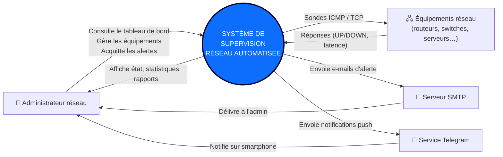

# Diagramme de contexte

Le **diagramme de contexte** présente le système comme une « boîte noire »
unique et identifie les **acteurs externes** qui interagissent avec lui ainsi
que les **flux** entrants/sortants. Il fixe le périmètre du projet.

## Acteurs identifiés

| Acteur | Rôle |
|--------|------|
| **Administrateur réseau** | Acteur principal : configure les équipements, consulte le tableau de bord et traite les alertes. |
| **Équipements réseau** | Acteurs supervisés : cibles passives des sondes. |
| **Serveur SMTP** | Acteur secondaire : relaie les alertes par e-mail. |
| **Service Telegram** | Acteur secondaire : délivre les notifications instantanées. |
