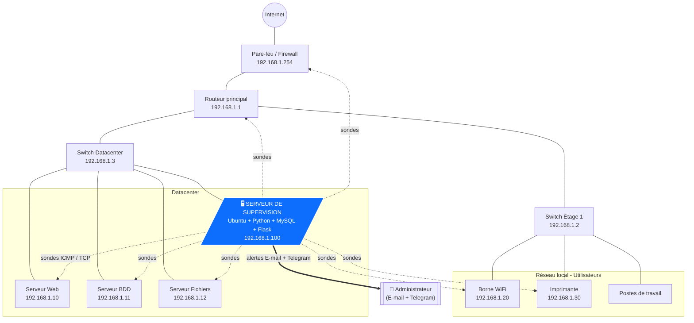

# Schéma d'architecture réseau

Ce schéma situe le **serveur de supervision** dans une topologie réseau
d'entreprise réaliste et illustre les **flux** de sondage et d'alerte.

## Topologie (diagramme Mermaid)

## Lecture du schéma

- Le **serveur de supervision** (192.168.1.100) est placé dans le **datacenter**,
  au plus près des équipements critiques, mais il sonde l'ensemble du LAN à
  travers les switches et le routeur.
- Les **flux de sondage** (lignes pointillées) sont des paquets ICMP (ping) et
  des connexions TCP vers les ports de service — trafic très léger, sans impact
  notable sur la bande passante.
- Les **flux d'alerte** (flèche pleine) partent du serveur vers l'extérieur :
  e-mail via SMTP et notification Telegram via Internet (HTTPS), atteignant
  l'administrateur **où qu'il soit**, y compris hors du site.

## Recommandations de placement

1. Placer le serveur sur un **VLAN d'administration** dédié pour isoler le
   trafic de supervision.
2. Lui affecter une **adresse IP fixe** (essentiel : c'est un service permanent).
3. Autoriser dans le pare-feu les **flux sortants** SMTP (587) et HTTPS (443)
   pour les notifications.
4. Prévoir un **onduleur (UPS)** : un serveur de supervision doit rester en vie
   pendant les coupures qu'il est censé détecter.
