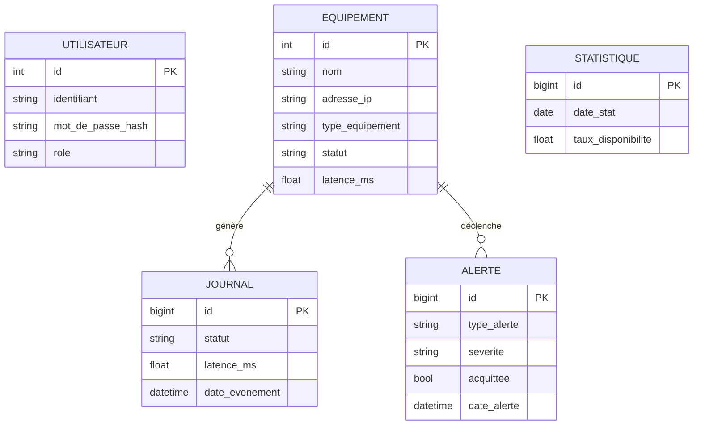

# Modélisation de la base de données : MCD, MLD et MPD

Ce document présente la conception de la base selon la méthode **MERISE**,
largement enseignée dans le cursus francophone : du **Modèle Conceptuel de
Données (MCD)** vers le **Modèle Logique de Données (MLD)**, puis le **Modèle
Physique (MPD)** matérialisé par le script `schema.sql`.

## 1. Modèle Conceptuel de Données (MCD)

Le MCD décrit les **entités** et leurs **associations**, indépendamment de
toute technologie.




### Description des entités et associations

- **EQUIPEMENT** *génère* **JOURNAL** : un équipement produit plusieurs lignes
  de journal (cardinalité 1,n) ; chaque journal appartient à un seul équipement.
- **EQUIPEMENT** *déclenche* **ALERTE** : un équipement peut déclencher
  plusieurs alertes ; chaque alerte concerne un seul équipement.
- **UTILISATEUR** : entité indépendante (gestion des accès au tableau de bord).
- **STATISTIQUE** : agrégat journalier calculé, sans clé étrangère directe
  (instantané global du parc).

## 2. Modèle Logique de Données (MLD)

Le MLD traduit le MCD en tables relationnelles. Les associations « 1,n » se
matérialisent par une **clé étrangère** côté « n ».


```
UTILISATEUR (id, identifiant, mot_de_passe_hash, nom_complet, email, role, actif, date_creation)
    Clé primaire : id

EQUIPEMENT (id, nom, adresse_ip, type_equipement, emplacement,
            service_supervise, statut, latence_ms, derniere_verification,
            actif, date_ajout)
    Clé primaire : id

JOURNAL (id, #equipement_id, statut, latence_ms, message, date_evenement)
    Clé primaire : id
    Clé étrangère : equipement_id → EQUIPEMENT(id)

ALERTE (id, #equipement_id, type_alerte, severite, message, canal,
        acquittee, date_alerte, date_acquittement)
    Clé primaire : id
    Clé étrangère : equipement_id → EQUIPEMENT(id)

STATISTIQUE (id, date_stat, total_equipements, equipements_up,
             equipements_down, taux_disponibilite, latence_moyenne, nombre_alertes)
    Clé primaire : id
```

> Légende : `#` = clé étrangère.

## 3. Modèle Physique de Données (MPD)

Le MPD est l'implémentation concrète dans MySQL : voir le fichier
[`schema.sql`](schema.sql). Choix physiques notables :

- Moteur **InnoDB** (transactions + intégrité référentielle via clés étrangères).
- Jeu de caractères **utf8mb4** (support complet Unicode, y compris emojis).
- **Index** sur les colonnes filtrées (`statut`, `acquittee`, `equipement_id`)
  pour accélérer les requêtes du tableau de bord.
- **`ON DELETE CASCADE`** : la suppression d'un équipement purge
  automatiquement ses journaux et alertes (cohérence des données).
- Contrainte **UNIQUE** sur `adresse_ip` : empêche les doublons d'équipement.

## 4. Règles de gestion

1. Un équipement est identifié de façon unique par son adresse IP.
2. Toute vérification produit exactement une ligne de journal.
3. Une alerte non acquittée bloque l'émission d'une alerte identique (anti-spam).
4. Le retour en ligne d'un équipement acquitte automatiquement ses alertes de panne.
5. Le mot de passe d'un utilisateur n'est jamais stocké en clair.
