<div align="center">

**RÉPUBLIQUE DE CÔTE D'IVOIRE**
*Union — Discipline — Travail*

**MINISTÈRE DE L'ENSEIGNEMENT SUPÉRIEUR ET DE LA RECHERCHE SCIENTIFIQUE**

**[NOM DE L'UNIVERSITÉ / GRANDE ÉCOLE]**

**DÉPARTEMENT RÉSEAUX ET INFORMATIQUE / TÉLÉCOMMUNICATIONS (RIT)**

---
---

*MÉMOIRE DE FIN DE CYCLE*
*En vue de l'obtention du diplôme de*
**MASTER 2 — RÉSEAUX ET INFORMATIQUE / TÉLÉCOMMUNICATIONS (RIT)**

---

# AUTOMATISATION DE LA SUPERVISION ET DE LA DÉTECTION DES PANNES RÉSEAU

### Conception et déploiement d'une solution open-source au sein de l'entreprise OPEN MOISE

---
---

**Présenté et soutenu publiquement par :**
**[NOM Prénom de l'étudiant]**

| | |
|---|---|
| **Directeur de mémoire :** | **Maître de stage (OPEN MOISE) :** |
| [Grade — NOM Prénom] | [NOM Prénom — Fonction] |

**Structure d'accueil : OPEN MOISE** *(Entreprise de Services du Numérique)*

---

**Année académique 2025 – 2026**

</div>

```{=openxml}
<w:p><w:r><w:br w:type="page"/></w:r></w:p>
```

# DÉDICACE

<div align="center">

*Je dédie ce travail :*

*À mes chers parents,*
*pour leur amour, leurs sacrifices et leur soutien indéfectible ;*

*À toute ma famille et à mes proches,*
*pour leurs encouragements constants ;*

*À mes enseignants du département RIT,*
*qui ont éclairé mon parcours ;*

*À l'ensemble du personnel d'OPEN MOISE,*
*pour son accueil et son partage d'expérience ;*

*À mes camarades de promotion.*

</div>

```{=openxml}
<w:p><w:r><w:br w:type="page"/></w:r></w:p>
```

# REMERCIEMENTS

La réalisation de ce mémoire n'aurait pas été possible sans le concours de
nombreuses personnes à qui je tiens à exprimer ma sincère reconnaissance.

Je remercie tout d'abord mon **directeur de mémoire, [Grade — NOM Prénom]**,
pour la qualité de son encadrement, sa disponibilité, ses orientations
méthodologiques et sa rigueur scientifique tout au long de ce travail.

Je remercie l'ensemble du **corps professoral du département RIT** pour la
formation solide dispensée durant ces années d'études.

Mes remerciements vont également à la **direction de l'entreprise OPEN MOISE**
pour m'avoir accueilli en stage, ainsi qu'à mon **maître de stage [NOM Prénom]**
et à toute l'équipe technique, pour leur disponibilité, leur partage
d'expérience et l'accès au terrain qui ont nourri ce travail.

J'adresse enfin ma gratitude aux **membres du jury** pour l'honneur qu'ils me
font d'évaluer ce mémoire, ainsi qu'à ma **famille** et à mes **amis** pour
leur soutien moral.

À toutes et à tous, **merci**.

```{=openxml}
<w:p><w:r><w:br w:type="page"/></w:r></w:p>
```

# RÉSUMÉ

La disponibilité des infrastructures réseau est devenue un enjeu stratégique
pour les organisations et, plus encore, pour les **entreprises de services du
numérique (ESN)** qui en assurent l'exploitation pour le compte de leurs
clients. C'est le cas d'**OPEN MOISE**, structure d'accueil de ce projet, qui
supervise les réseaux de plusieurs clients sous engagements de niveau de
service (SLA). Or, cette supervision reposait largement sur des contrôles
**manuels et réactifs** : les pannes étaient souvent découvertes tardivement,
fréquemment signalées par le client lui-même, sans traçabilité exploitable.

Ce mémoire propose la **conception, la réalisation et le déploiement** d'un
système d'**automatisation de la supervision et de la détection des pannes
réseau**, fondé **exclusivement sur des outils open-source** : serveur Linux
Ubuntu, moteur de collecte en **Python** ordonnancé par **Cron**, base de
données **MySQL**, et **tableau de bord web** développé avec **Flask** et
**Bootstrap**. Le système réalise la **découverte automatique** des équipements,
la **surveillance** de leur disponibilité (sondes ICMP et TCP), la
**journalisation** des événements, et la **génération d'alertes en temps réel**
par **courrier électronique (SMTP)** et par **notification instantanée
Telegram**.

Les évaluations menées montrent que l'automatisation fait chuter le **temps
moyen de détection** d'environ une heure à moins de **deux minutes**, réduit le
**temps de réaction** des équipes et améliore le **taux de disponibilité** du
parc supervisé, le tout pour un **coût de licence nul**. Au-delà de l'outil
interne, la solution ouvre pour OPEN MOISE une **nouvelle offre de supervision
managée** à destination de ses clients, et prépare l'évolution vers une
supervision **prédictive** assistée par l'intelligence artificielle.

**Mots-clés :** supervision réseau, automatisation, détection de pannes,
open-source, Python, Flask, MySQL, Telegram, DevOps, SLA, OPEN MOISE.

# ABSTRACT

The availability of network infrastructures has become a strategic concern for
organizations and, even more, for **Managed Service Providers (MSP/ESN)** that
operate them on behalf of their clients. This is the case of **OPEN MOISE**,
the host company of this project, which monitors several client networks under
**Service Level Agreements (SLA)**. However, this monitoring relied largely on
**manual and reactive** checks: failures were often discovered late, frequently
reported by the client itself, with no usable traceability.

This thesis proposes the **design, implementation and deployment** of an
**automated network monitoring and fault-detection system**, based
**exclusively on open-source tools**: a Linux Ubuntu server, a collection
engine written in **Python** and scheduled by **Cron**, a **MySQL** database,
and a **web dashboard** built with **Flask** and **Bootstrap**. The system
performs **automatic device discovery**, availability **monitoring** (ICMP and
TCP probes), event **logging**, and **real-time alerting** through **e-mail
(SMTP)** and **instant Telegram notifications**.

The evaluations show that automation reduces the **mean time to detect** from
about one hour to less than **two minutes**, shortens the teams' **reaction
time**, and improves the **availability rate** of the monitored network, all at
**zero licensing cost**. Beyond the internal tool, the solution opens for OPEN
MOISE a **new managed-monitoring service offering** for its clients, and paves
the way toward **predictive** monitoring supported by artificial intelligence.

**Keywords:** network monitoring, automation, fault detection, open-source,
Python, Flask, MySQL, Telegram, DevOps, SLA, OPEN MOISE.

```{=openxml}
<w:p><w:r><w:br w:type="page"/></w:r></w:p>
```

# LISTE DES ABRÉVIATIONS ET ACRONYMES

| Sigle | Signification |
|-------|---------------|
| **AIOps** | Artificial Intelligence for IT Operations |
| **API** | Application Programming Interface |
| **CIDR** | Classless Inter-Domain Routing |
| **CRUD** | Create, Read, Update, Delete |
| **DAL** | Data Access Layer (couche d'accès aux données) |
| **DevOps** | Development and Operations |
| **DNS** | Domain Name System |
| **ESN** | Entreprise de Services du Numérique |
| **FCFA** | Franc de la Communauté Financière Africaine (XOF) |
| **HTTP(S)** | HyperText Transfer Protocol (Secure) |
| **ICMP** | Internet Control Message Protocol |
| **IP** | Internet Protocol |
| **KPI** | Key Performance Indicator (indicateur clé de performance) |
| **LAN** | Local Area Network |
| **MCD / MLD / MPD** | Modèle Conceptuel / Logique / Physique de Données |
| **MTTD** | Mean Time To Detect (temps moyen de détection) |
| **MTTR** | Mean Time To Repair/Respond (temps moyen de réaction) |
| **MSP** | Managed Service Provider |
| **PME** | Petite et Moyenne Entreprise |
| **RTT** | Round Trip Time (temps d'aller-retour) |
| **SGBD** | Système de Gestion de Base de Données |
| **SLA** | Service Level Agreement (engagement de niveau de service) |
| **SMTP** | Simple Mail Transfer Protocol |
| **SNMP** | Simple Network Management Protocol |
| **SQL** | Structured Query Language |
| **SSH** | Secure Shell |
| **TCP** | Transmission Control Protocol |
| **UML** | Unified Modeling Language |
| **VLAN** | Virtual Local Area Network |
| **WSGI** | Web Server Gateway Interface |
| **XOF** | Code ISO du franc CFA (Afrique de l'Ouest) |

```{=openxml}
<w:p><w:r><w:br w:type="page"/></w:r></w:p>
```

# LISTE DES FIGURES

| N° | Figure |
|----|--------|
| Figure 1 | Architecture en cinq couches du système de supervision |
| Figure 2 | Diagramme de contexte |
| Figure 3 | Diagramme de cas d'utilisation |
| Figure 4 | Diagramme de séquence |
| Figure 5 | Diagramme d'activité |
| Figure 6 | Diagramme de classes |
| Figure 7 | Diagramme de composants |
| Figure 8 | Diagramme de déploiement |
| Figure 9 | Modèle Conceptuel de Données (MCD) |
| Figure 10 | Modèle Logique de Données (MLD) |
| Figure 11 | Page de connexion sécurisée |
| Figure 12 | Tableau de bord temps réel |
| Figure 13 | Notification Telegram reçue par l'astreinte |
| Figure 14 | Historique des alertes |
| Figure 15 | Gestion des équipements |
| Figure 16 | Rapports et statistiques |

# LISTE DES TABLEAUX

| N° | Tableau |
|----|---------|
| Tableau 1 | Hypothèses de recherche |
| Tableau 2 | Résultats attendus et indicateurs cibles |
| Tableau 3 | Outils techniques mobilisés |
| Tableau 4 | Comparatif des solutions de supervision |
| Tableau 5 | Facteurs de différenciation |
| Tableau 6 | Justification des choix technologiques |
| Tableau 7 | Sécurité « by design » |
| Tableau 8 | Tests de performance |
| Tableau 9 | Modèle économique |
| Tableau 10 | Investissement et revenus prévisionnels (FCFA) |

> *La table des matières détaillée est générée automatiquement ci-après.*

```{=openxml}
<w:p><w:r><w:br w:type="page"/></w:r></w:p>
```
# PRÉSENTATION DE LA STRUCTURE D'ACCUEIL : OPEN MOISE

> *Les informations entre crochets `[...]` sont à compléter avec les données
> officielles de l'entreprise (registre du commerce, organigramme, plaquette).*

## 1. Présentation générale

**OPEN MOISE** est une **Entreprise de Services du Numérique (ESN)** de droit
ivoirien, implantée à **[ville]** depuis **[année]**. Elle accompagne les
organisations — PME, administrations, établissements et commerces — dans la
**conception, le déploiement et l'exploitation** de leurs infrastructures
informatiques et réseau.

| Élément | Information |
|---------|-------------|
| Raison sociale | OPEN MOISE |
| Forme juridique | [SARL / SAS / …] |
| Année de création | [année] |
| Siège social | [adresse, ville — Côte d'Ivoire] |
| Secteur d'activité | Services numériques (ESN / infogérance) |
| Effectif | [nombre] collaborateurs |
| Dirigeant | [NOM Prénom] |

## 2. Mission et domaines d'activité

La mission d'OPEN MOISE est de **garantir à ses clients un système d'information
performant, disponible et sécurisé**. Ses principaux pôles d'activité sont :

- **Infogérance et supervision** : exploitation et surveillance des réseaux et
  systèmes des clients, dans le cadre de contrats de service (SLA) ;
- **Intégration réseau et systèmes** : installation d'équipements actifs
  (routeurs, commutateurs, pare-feu), de serveurs et de solutions de
  connectivité ;
- **Développement applicatif et conseil** : applications métier, automatisation
  des processus, accompagnement à la transformation numérique ;
- **Cybersécurité** : protection, sauvegarde et continuité d'activité.

## 3. Organisation

OPEN MOISE est structurée autour de plusieurs pôles — **[Direction technique,
Pôle Infrastructures & Supervision, Pôle Développement, Support client]**. Le
présent projet a été conduit au sein du **[Pôle Infrastructures &
Supervision]**, sous la responsabilité de **[NOM Prénom — fonction]**.

## 4. Justification du projet au sein d'OPEN MOISE

En tant qu'ESN assurant l'**infogérance** des infrastructures de ses clients,
OPEN MOISE est directement exposée à la problématique traitée dans ce mémoire :
**détecter au plus tôt les pannes** des parcs qu'elle exploite et **réduire le
temps d'intervention** de ses équipes d'astreinte. La solution développée
constitue un **outil interne à forte valeur ajoutée** : elle permet
d'**industrialiser** la supervision, d'**améliorer la qualité de service**
(respect des SLA), de **renforcer la traçabilité** des incidents et de
**maîtriser les coûts** grâce à l'usage exclusif de technologies open-source.
Elle ouvre en outre la voie à une **nouvelle offre commerciale** : la
**supervision managée** facturée aux clients.

```{=openxml}
<w:p><w:r><w:br w:type="page"/></w:r></w:p>
```

# INTRODUCTION GÉNÉRALE

À l'ère de la transformation numérique, le réseau informatique constitue le
**système nerveux** de toute organisation. La messagerie, la téléphonie sur IP,
les applications métier, l'accès à Internet, les services bancaires en ligne ou
encore les systèmes de paiement mobile — omniprésents en Côte d'Ivoire et dans
la sous-région — reposent intégralement sur la disponibilité et la fiabilité de
l'infrastructure réseau. Une interruption de service, même brève, se traduit
par une perte de productivité, un manque à gagner, une dégradation de l'image
et, dans les secteurs critiques, par des conséquences plus lourdes encore.

Cette exigence de **continuité de service** est particulièrement aiguë pour les
**entreprises de services du numérique (ESN)** telles qu'**OPEN MOISE**, qui
exploitent les réseaux de leurs clients dans le cadre de contrats assortis
d'**engagements de niveau de service (SLA)**. Pour ces prestataires, la
capacité à **détecter rapidement les pannes** et à **intervenir avant que le
client ne s'en aperçoive** est un facteur déterminant de compétitivité et de
fidélisation.

Or, le constat dressé au sein d'OPEN MOISE — et largement partagé dans les
structures de taille comparable — est celui d'une supervision encore **manuelle
et réactive** : des contrôles ponctuels (commandes `ping`, connexions aux
équipements), une détection des incidents reposant le plus souvent sur le
**signalement du client**, et une **absence de traçabilité** exploitable. Ce
mode de fonctionnement allonge mécaniquement le **temps de détection** et le
**temps d'intervention**, fragilise le respect des SLA et mobilise inutilement
les ressources humaines.

Des solutions de supervision existent pourtant — propriétaires (PRTG,
SolarWinds) ou open-source (Nagios, Zabbix, Centreon). Mais les premières sont
**coûteuses** et les secondes, bien que puissantes, sont souvent jugées
**lourdes et complexes** à déployer et à maintenir pour une structure aux moyens
mesurés. Il existe donc un **espace** pour une solution **légère, économique,
sur mesure et entièrement maîtrisée**, bâtie à partir de briques open-source.

C'est l'objet de ce mémoire-projet : **concevoir, réaliser et déployer chez OPEN
MOISE un système d'automatisation de la supervision et de la détection des
pannes réseau**, fondé exclusivement sur des outils open-source, et **le penser
comme un véritable produit** — depuis le besoin du terrain jusqu'au modèle
économique. Conformément au canevas mémoire-projet, le document s'organise
ainsi : après l'identification du **problème** (chap. 1), nous précisons les
**objectifs** (chap. 2) et la **démarche méthodologique** (chap. 3), puis nous
réalisons l'**état des lieux** des solutions et présentons la **solution
proposée** (chap. 4) et son **axe de différenciation** (chap. 5). Suivent
l'**étude de faisabilité et la conception** (chap. 6), le **fonctionnement
technique** (chap. 7) et la **démonstration** illustrée par les écrans de
l'application (chap. 8). Enfin, nous abordons le volet **marketing et
concurrence** (chap. 9), les **prévisions financières** en francs CFA (chap.
10), puis les **limites et perspectives** (chap. 11), avant de conclure.

```{=openxml}
<w:p><w:r><w:br w:type="page"/></w:r></w:p>
```

# CHAPITRE 1 — CONTEXTE ET IDENTIFICATION DU PROBLÈME

## 1.1 Contexte général

La dernière décennie a vu une **densification** sans précédent des
infrastructures réseau : multiplication des équipements actifs, virtualisation
des serveurs, adoption du cloud, mobilité des utilisateurs et explosion des
objets connectés. En Côte d'Ivoire, la généralisation de la fibre optique, la
croissance du commerce électronique et la prééminence du **paiement mobile**
ont fait du réseau une ressource **critique** pour l'activité économique.

Parallèlement, les attentes en matière de **disponibilité** se sont élevées :
les organisations visent désormais des objectifs de l'ordre de **99,9 %**, soit
moins de neuf heures d'indisponibilité cumulée par an. Atteindre et **prouver**
de tels niveaux suppose une surveillance **continue, outillée et tracée** — ce
que la supervision manuelle ne permet pas.

### 1.1.1 Le contexte numérique ivoirien

La Côte d'Ivoire connaît une transformation numérique soutenue : extension de la
couverture en fibre optique, essor du **commerce électronique**, dématérialisation
des services publics et, surtout, prééminence du **paiement mobile (mobile
money)**, devenu un instrument quotidien pour des millions d'usagers et de
commerçants. Cette dépendance accrue au numérique élève le **coût de
l'indisponibilité** : une interruption réseau peut bloquer des transactions, des
encaissements et des services entiers. Pour les prestataires informatiques
locaux comme OPEN MOISE, la **qualité et la continuité de service** deviennent
ainsi des facteurs déterminants de différenciation, dans un marché où la maîtrise
des **coûts** reste néanmoins primordiale. Ce double impératif — fiabilité
*et* économie — oriente directement les choix de ce projet vers l'**open-source**.

## 1.2 Contexte spécifique : la supervision chez OPEN MOISE

En tant qu'ESN, OPEN MOISE exploite pour le compte de ses clients des parcs
hétérogènes : routeurs, commutateurs, pare-feu, serveurs (web, base de données,
fichiers), points d'accès Wi-Fi et imprimantes réseau. Chaque client est lié à
OPEN MOISE par un **contrat de service** précisant des engagements de
disponibilité et des délais d'intervention.

L'observation des pratiques au sein du pôle d'accueil révèle que la surveillance
de ces parcs s'effectue essentiellement **à la demande** : un technicien lance
des commandes `ping` ou se connecte aux équipements lorsqu'un dysfonctionnement
est suspecté ou signalé. Aucun dispositif n'assure une **veille permanente et
automatique** de l'ensemble des équipements.

## 1.3 Constat et formulation du problème

De cette situation découlent plusieurs **dysfonctionnements** :

1. **Détection tardive** : la panne est le plus souvent révélée par le **client
   lui-même**, c'est-à-dire *après* que le service a été dégradé. Le temps moyen
   de détection (MTTD) se compte en **dizaines de minutes**, voire en heures.
2. **Réaction différée** : l'équipe d'astreinte n'étant pas alertée
   automatiquement, le **temps moyen de réaction** (MTTR) s'allonge d'autant.
3. **Absence de traçabilité** : faute d'historisation, il est difficile de
   **prouver le respect des SLA**, d'analyser les pannes récurrentes ou de
   produire des rapports clients.
4. **Charge humaine et risque d'erreur** : la surveillance manuelle est
   **chronophage**, non extensible au-delà de quelques équipements, et sujette à
   la fatigue.
5. **Risque commercial** : la détection tardive met en péril les engagements
   contractuels et, à terme, la **relation de confiance** avec le client.

Le problème central se formule ainsi : **l'absence d'un dispositif automatisé,
accessible et économique de supervision empêche OPEN MOISE de détecter
précocement les pannes des réseaux qu'elle exploite et allonge le temps
d'intervention de ses équipes, au détriment de la qualité de service et de la
maîtrise des coûts.**

## 1.4 Questions de recherche

### Question principale

> **Comment OPEN MOISE peut-elle détecter en temps réel les pannes des réseaux
> qu'elle supervise et réduire le temps d'intervention de ses équipes, à l'aide
> d'une solution automatisée, fiable et économiquement accessible, fondée sur
> des outils open-source ?**

### Questions secondaires

1. Quels concepts et technologies fondent la supervision et l'automatisation
   réseau, et quelles solutions existent déjà sur le marché ?
2. Quelle architecture logicielle et matérielle, à base d'outils open-source,
   répond aux besoins d'OPEN MOISE ?
3. Comment notifier l'astreinte de manière instantanée et fiable, où qu'elle se
   trouve ?
4. Dans quelle mesure l'automatisation améliore-t-elle concrètement le temps de
   détection, le temps de réaction et le taux de disponibilité, et à quel coût ?

## 1.5 Justification et intérêt du sujet

L'intérêt de ce sujet est triple. Sur le plan **professionnel**, il répond à un
besoin réel et immédiat d'OPEN MOISE et améliore sa compétitivité. Sur le plan
**économique**, il démontre qu'une solution efficace peut être bâtie sans
licence coûteuse — argument décisif dans le contexte ivoirien. Sur le plan
**scientifique et pédagogique**, il mobilise l'ensemble des compétences du
Master RIT (réseaux, programmation, bases de données, systèmes Linux,
cybersécurité, DevOps) et s'inscrit dans les pratiques d'**ingénierie
contemporaines** (automatisation, observabilité, AIOps).

```{=openxml}
<w:p><w:r><w:br w:type="page"/></w:r></w:p>
```
# CHAPITRE 2 — OBJECTIFS ET RÉSULTATS ATTENDUS

## 2.1 Objectif général

Concevoir, réaliser et déployer au sein d'OPEN MOISE un **système automatisé de
supervision et de détection des pannes réseau**, fondé exclusivement sur des
scripts et des outils open-source, capable de **détecter les pannes en temps
réel**, d'**alerter instantanément** les équipes et de **réduire le temps
d'intervention**, tout en assurant la **traçabilité** des incidents.

## 2.2 Objectifs spécifiques

1. **Analyser** l'existant et comparer les principales solutions de supervision
   afin de positionner la solution proposée.
2. **Concevoir** une architecture modulaire et extensible reposant sur des
   briques open-source (Linux, Python, Cron, MySQL, Flask, Telegram), formalisée
   en **UML** et **MERISE**.
3. **Développer** les modules de **découverte** des équipements, de
   **surveillance** de la disponibilité (sondes ICMP et TCP) et de
   **journalisation**.
4. **Mettre en place** un système d'**alertes multi-canal** en temps réel
   (e-mail et Telegram), robuste aux faux positifs et au « spam » d'alertes.
5. **Réaliser** un **tableau de bord web** de visualisation, de gestion et de
   reporting.
6. **Évaluer** les performances et **mesurer** l'apport de l'automatisation par
   rapport à la supervision manuelle.

## 2.3 Hypothèses de recherche

| Code | Hypothèse |
|------|-----------|
| **H1** | L'automatisation réduit le **temps moyen de détection (MTTD)** par rapport à la supervision manuelle. |
| **H2** | Les alertes temps réel (e-mail + Telegram) réduisent le **temps moyen de réaction (MTTR)** des équipes. |
| **H3** | L'usage exclusif d'outils open-source atteint un niveau de service comparable aux solutions propriétaires pour un **coût quasi nul**. |
| **H4** | La journalisation systématique améliore la **traçabilité** et le **taux de disponibilité** du parc supervisé. |

## 2.4 Résultats attendus (indicateurs)

Les objectifs sont assortis d'**indicateurs mesurables** servant à valider les
hypothèses :

| Résultat attendu | Indicateur cible |
|------------------|------------------|
| Détection en temps réel | **MTTD < 2 minutes** (vs ~30–60 min) |
| Réaction rapide de l'astreinte | **MTTR < 5 minutes** (vs ~45 min) |
| Surveillance autonome | **0 intervention humaine** sur la collecte |
| Traçabilité complète | **100 %** des vérifications journalisées |
| Disponibilité améliorée | **≈ 97,5 % → ≈ 99,5 %** |
| Coût de licence | **0 FCFA** (open-source) |

```{=openxml}
<w:p><w:r><w:br w:type="page"/></w:r></w:p>
```

# CHAPITRE 3 — DÉMARCHE MÉTHODOLOGIQUE

## 3.1 Type de recherche

Ce travail relève d'une **recherche appliquée** à caractère **expérimental**.
Il ne se limite pas à analyser un phénomène : il vise à **produire un artefact**
— le système de supervision — et à en **évaluer l'efficacité** par la mesure. Il
s'inscrit dans le paradigme de la **recherche-conception** (*Design Science
Research*), particulièrement adapté aux sciences de l'ingénieur, où la
connaissance se construit à travers la conception, la réalisation et
l'évaluation d'un système répondant à un problème concret.

## 3.2 Approche méthodologique

L'approche combine une dimension **qualitative** (analyse de l'existant, étude
comparative des solutions, observation des pratiques d'OPEN MOISE) et une
dimension **quantitative** (mesure de métriques : temps de détection, temps de
réaction, taux de disponibilité, latence). Le **cycle de développement** est
**itératif et incrémental**, inspiré de la philosophie **DevOps** :

> Analyse → Conception (UML / MERISE) → Développement → Test → Intégration →
> Mesure → *itération*

Chaque module a été développé, testé puis intégré avant de passer au suivant,
ce qui a permis une montée en charge progressive et un contrôle continu de la
qualité.

## 3.3 Techniques et outils de collecte des données

- **Recherche documentaire** : ouvrages, articles, documentations techniques et
  standards (RFC) relatifs à la supervision réseau ;
- **Observation participante** : analyse, sur le terrain d'OPEN MOISE, des
  pratiques de supervision manuelle et des incidents traités ;
- **Expérimentation** : déploiement d'un prototype dans un **environnement de
  test** (réseau local et machines virtuelles reproduisant un parc client) et
  **collecte automatisée des métriques** via les journaux du système ;
- **Entretiens informels** avec les techniciens d'astreinte d'OPEN MOISE pour
  recueillir les temps de détection/réaction de référence.

## 3.4 Méthode d'analyse

L'analyse procède par **comparaison « avant / après »** (supervision manuelle
*versus* supervision automatisée), à l'aide d'**indicateurs de performance
(KPI)** : MTTD, MTTR, taux de disponibilité et latence moyenne. Les résultats
sont présentés sous forme de **tableaux** et de **graphiques** afin de
**valider ou réfuter les hypothèses**. La conception est formalisée avec la
notation **UML** (sept diagrammes) et la méthode **MERISE** pour la base de
données.

## 3.5 Outils techniques mobilisés

| Catégorie | Outil retenu | Rôle |
|-----------|--------------|------|
| Système d'exploitation | Ubuntu Server 22.04 LTS | Hôte du serveur de supervision |
| Langage | Python 3 | Moteur de collecte et logique métier |
| Ordonnancement | Cron | Exécution périodique automatique |
| Base de données | MySQL 8 | Stockage (équipements, journaux, alertes) |
| Framework web | Flask | Tableau de bord et API REST |
| Interface | Bootstrap 5, Chart.js | Présentation responsive et graphiques |
| Notifications | SMTP, API Bot Telegram | Alertes e-mail et push mobile |
| Modélisation | UML (PlantUML), MERISE | Conception |
| Tests | unittest / pytest | Validation logicielle |

## 3.6 Planning de réalisation du projet

Le projet a été conduit sur une période d'environ quatre mois, selon un
découpage en phases successives mais partiellement recouvrantes (approche
itérative).

| Phase | Activités principales | Durée indicative |
|-------|------------------------|------------------|
| 1. Cadrage | Observation du terrain OPEN MOISE, recueil du besoin, problématique | 2 semaines |
| 2. État de l'art | Recherche documentaire, comparaison des solutions | 2 semaines |
| 3. Conception | Architecture, UML, MERISE, choix technologiques | 3 semaines |
| 4. Développement | Moteur, sondes, alertes, base de données, tableau de bord | 5 semaines |
| 5. Tests | Tests unitaires, fonctionnels et de performance | 2 semaines |
| 6. Évaluation | Mesures comparatives, analyse des résultats | 2 semaines |
| 7. Rédaction | Rédaction du mémoire et préparation de la soutenance | en continu |

## 3.7 Délimitation du champ de l'étude

L'étude porte sur la **supervision active de disponibilité** (sondes ICMP et
TCP) et la **détection de pannes** au niveau des couches réseau (3) et
transport/application (4–7). La supervision fine des **métriques internes** des
équipements (CPU, mémoire, trafic) par **SNMP**, ainsi que les aspects
contractuels détaillés des SLA, sont identifiés comme **perspectives** et
n'entrent pas dans le périmètre du prototype.

```{=openxml}
<w:p><w:r><w:br w:type="page"/></w:r></w:p>
```
# CHAPITRE 4 — ÉTAT DES LIEUX DES SOLUTIONS EXISTANTES ET SOLUTION PROPOSÉE

## 4.1 Cadre conceptuel et définitions

Avant de comparer les solutions, il convient de préciser les concepts mobilisés.

- **Réseau informatique** : ensemble d'équipements interconnectés échangeant des
  données via des protocoles normalisés, principalement la suite **TCP/IP**. La
  communication est structurée en couches (modèles OSI et TCP/IP).
- **Administration réseau** : ensemble des activités assurant le fonctionnement,
  la performance et la sécurité d'un réseau. Le modèle de référence **FCAPS**
  (ISO/UIT-T) la décompose en gestion des **pannes**, de la **configuration**,
  de la **comptabilité**, des **performances** et de la **sécurité**. La
  supervision relève surtout des volets *Fault* et *Performance*.
- **Supervision réseau** : processus continu de surveillance de l'état et de la
  performance des composants, visant à **détecter, diagnostiquer et signaler**
  les anomalies. Elle s'appuie sur des **sondes** interrogeant périodiquement
  les équipements et sur des **seuils** déclenchant des alertes.
- **Monitoring / observabilité** : collecte et visualisation continue de
  **métriques** (disponibilité, latence, charge), enrichie aujourd'hui par les
  **logs** et les **traces**.
- **Protocoles de sonde** : l'**ICMP** (commande `ping`) teste la joignabilité
  en couche 3 ; une **sonde TCP** teste l'ouverture d'un port applicatif
  (couche 4–7) ; le **SNMP** interroge des variables internes des équipements.
- **Automatisation** : délégation à des programmes des tâches répétitives, pour
  gagner en rapidité, en fiabilité et en cohérence.
- **Open-source** : logiciel dont le code est librement accessible, modifiable
  et redistribuable (licences GPL, MIT, Apache). Avantages : gratuité,
  transparence, communauté, absence de dépendance à un éditeur (*vendor
  lock-in*).
- **DevOps** : culture rapprochant développement et exploitation autour de
  l'automatisation, de l'intégration continue et de la **surveillance
  continue** — dont la supervision est un pilier.
- **SLA (Service Level Agreement)** : engagement contractuel de niveau de
  service (ex. taux de disponibilité garanti, délai d'intervention).

## 4.2 La supervision manuelle

La supervision manuelle consiste à vérifier l'état du réseau au moyen de
commandes ponctuelles (`ping`, `traceroute`, `nslookup`, connexions SSH).

**Avantages :** simplicité, aucun investissement logiciel, contrôle direct.

**Inconvénients :** caractère **réactif** (on découvre la panne après coup),
**chronophage**, **non tracé**, **non extensible**, dépendant de la
disponibilité humaine et sujet à l'erreur. C'est précisément le mode de
fonctionnement initial d'OPEN MOISE, à l'origine du présent projet.

## 4.3 La supervision automatisée

La supervision automatisée délègue la surveillance à un système logiciel
fonctionnant en continu. Elle apporte la **réactivité** (détection quasi temps
réel), la **traçabilité** (historisation), l'**alerte proactive** et la
**scalabilité**. Plusieurs solutions matures existent, présentées ci-après.

### 4.3.1 Nagios

Solution open-source historique, reposant sur un cœur (*Nagios Core*) et un
système de **plugins**. Très **éprouvée** et extensible, mais de
**configuration complexe** (fichiers texte), à l'interface vieillissante et à la
courbe d'apprentissage élevée. *Nagios Core* est gratuit ; *Nagios XI* est
payant.

### 4.3.2 Zabbix

Plateforme open-source **complète et moderne** : SNMP, agents, découverte
automatique, interface web riche, historique en base. En contrepartie, elle est
**gourmande en ressources** et exige une configuration initiale conséquente,
disproportionnée pour de petits besoins. Logiciel gratuit, support payant.

### 4.3.3 PRTG Network Monitor

Solution **propriétaire** (Paessler) réputée pour sa **simplicité**, fondée sur
des « capteurs ». Installation aisée et interface intuitive, mais **serveur
Windows uniquement** et **tarification au nombre de capteurs**. Gratuite
jusqu'à 100 capteurs, puis **licence payante**.

### 4.3.4 Centreon

Solution française bâtie historiquement sur le moteur de Nagios, à l'interface
**modernisée** et dotée de fonctions de reporting. Édition open-source gratuite ;
modules avancés et éditions entreprise **payants**.

### 4.3.5 SolarWinds NPM

Solution **propriétaire** haut de gamme pour grandes infrastructures : très
complète (cartographie, analyses avancées), mais **coûteuse** et lourde, et
éditée par un acteur ayant connu un incident de sécurité majeur (chaîne
d'approvisionnement, 2020). **Licence élevée** (plusieurs millions de FCFA).

## 4.4 Tableau comparatif des solutions

| Critère | Nagios | Zabbix | PRTG | Centreon | SolarWinds | **Solution OPEN MOISE** |
|---------|:------:|:------:|:----:|:--------:|:----------:|:-----------------------:|
| Licence | Open-source | Open-source | Propriétaire | Mixte | Propriétaire | **Open-source** |
| Coût | Gratuit / payant | Gratuit | Payant | Gratuit / payant | Élevé | **Nul** |
| OS serveur | Linux | Linux | Windows | Linux | Windows | **Linux** |
| Simplicité de déploiement | Faible | Moyenne | Élevée | Moyenne | Faible | **Élevée** |
| Ressources requises | Faibles | Élevées | Moyennes | Moyennes | Élevées | **Très faibles** |
| Interface web | Basique | Riche | Riche | Riche | Riche | **Moderne (Bootstrap)** |
| Découverte auto. | Plugin | Oui | Oui | Oui | Oui | **Oui (Python)** |
| Alerte e-mail | Oui | Oui | Oui | Oui | Oui | **Oui** |
| Alerte mobile native | Plugin | Plugin | Appli | Plugin | Appli | **Oui (Telegram natif)** |
| Personnalisation du code | Limitée | Limitée | Non | Limitée | Non | **Totale** |
| Adapté aux PME / ESN | Moyen | Moyen | Oui | Moyen | Non | **Oui** |

## 4.5 Synthèse : le « vide » à combler

Les solutions existantes sont soit **puissantes mais complexes et gourmandes**
(Nagios, Zabbix, Centreon), soit **simples mais propriétaires et coûteuses**
(PRTG, SolarWinds). Pour OPEN MOISE et ses clients PME — qui recherchent une
solution **légère, gratuite, simple, sur mesure** et dotée d'une **notification
mobile native** —, il subsiste un **espace** qu'aucune solution ne comble
pleinement. Ce constat justifie le développement d'une **solution propre**
plutôt que l'adoption d'un outil existant.

## 4.6 La solution proposée

Nous proposons un **système de supervision automatisé, modulaire et 100 %
open-source**, conçu pour OPEN MOISE, qui :

- **découvre automatiquement** les équipements d'un sous-réseau client (scan
  CIDR parallélisé) ;
- **sonde en continu** la disponibilité (ICMP) et les services (TCP : HTTP, SSH,
  MySQL…) ;
- **confirme** la panne par un seuil d'échecs (anti-faux positif) et
  **journalise** chaque vérification (preuve de SLA) ;
- **alerte en temps réel** l'astreinte par **e-mail** et **Telegram**, avec
  logique **anti-spam** ;
- expose un **tableau de bord web** temps réel, la **gestion des équipements**,
  l'**historique des alertes** et des **rapports** exportables.

La pile technologique retenue est : **Ubuntu · Python · Cron · MySQL · Flask ·
Bootstrap · Bot Telegram**. Les justifications détaillées de ces choix et la
conception du système font l'objet du chapitre 6.

```{=openxml}
<w:p><w:r><w:br w:type="page"/></w:r></w:p>
```
# CHAPITRE 5 — L'AXE DE DIFFÉRENCIATION (INNOVATION TECHNOLOGIQUE)

## 5.1 Une innovation par l'assemblage

L'innovation de la solution ne réside pas dans l'invention d'un protocole
nouveau, mais dans un **assemblage différenciant** de briques éprouvées,
positionné exactement sur le besoin d'OPEN MOISE et de ses clients. Là où chaque
solution concurrente impose un compromis — gratuité *contre* complexité, ou
simplicité *contre* coût —, la solution proposée **réunit** simplicité,
gratuité, légèreté, notification mobile native et ouverture vers l'IA.

## 5.2 Les facteurs de différenciation

| Différenciateur | Bénéfice pour OPEN MOISE |
|-----------------|--------------------------|
| **Alerte Telegram native** | Astreinte alertée partout, sans coût de notification |
| **Ultra-légèreté** | 1 VM par client ou mutualisée : coûts d'exploitation réduits |
| **Code 100 % ouvert et maîtrisé** | Adaptation à chaque client, **zéro vendor lock-in** |
| **« Plug & supervise »** | Découverte automatique : onboarding d'un client en < 30 min |
| **Traçabilité orientée SLA** | Journaux exploitables comme **preuve de service** au client |
| **Prêt pour l'IA** | Historique structuré → futur service de **maintenance prédictive** |

## 5.3 Le marqueur : la notification mobile instantanée

Le principal marqueur d'innovation est l'intégration **native** d'un canal de
notification **push mobile gratuit** via **Telegram**. Sur ce point, les
solutions concurrentes imposent un plugin, une application payante ou une
passerelle SMS facturée. Pour une ESN dont la réactivité de l'astreinte est le
cœur de métier, recevoir l'alerte **instantanément sur smartphone**, où que l'on
soit, constitue un **avantage opérationnel et concurrentiel** direct.

## 5.4 Un socle évolutif

L'architecture **modulaire** et le stockage **structuré** de l'historique
préparent des évolutions à forte valeur : intégration de **SNMP**, détection
d'anomalies par **apprentissage automatique**, **maintenance prédictive** et
**auto-remédiation** (AIOps). La différenciation est donc aussi **temporelle** :
la solution constitue une **base de croissance** pour l'offre d'OPEN MOISE.

```{=openxml}
<w:p><w:r><w:br w:type="page"/></w:r></w:p>
```

# CHAPITRE 6 — ÉTUDE DE FAISABILITÉ ET CONCEPTION DE LA SOLUTION

## 6.1 Étude de faisabilité

### 6.1.1 Faisabilité technique

Toutes les briques retenues sont **matures, documentées et éprouvées** (Linux,
Python, MySQL, Flask). Les compétences nécessaires sont **déjà présentes** au
sein d'OPEN MOISE. La preuve de faisabilité est apportée par un **prototype
réalisé, testé et fonctionnel** (chapitres 7 et 8).

### 6.1.2 Faisabilité économique

Le coût de **licence est nul** (open-source) ; le matériel se réduit à un
**serveur léger** (machine virtuelle ou mini-serveur), éventuellement
**mutualisé** entre plusieurs clients. L'investissement initial est de l'ordre
de **130 000 FCFA** (détail au chapitre 10).

### 6.1.3 Faisabilité organisationnelle

La solution s'**intègre au processus d'astreinte** existant d'OPEN MOISE : les
alertes alimentent directement les canaux déjà utilisés par les équipes
(messagerie, Telegram). Le déploiement et la prise en main sont **rapides**.

> **Conclusion :** le projet est faisable sur les plans technique, économique et
> organisationnel.

## 6.2 Spécification des besoins

### 6.2.1 Besoins fonctionnels

- **BF1** — gérer l'inventaire des équipements (ajout, modification,
  suppression) ;
- **BF2** — découvrir automatiquement les équipements d'un sous-réseau ;
- **BF3** — surveiller périodiquement la disponibilité (ICMP) et les services
  (TCP) ;
- **BF4** — journaliser chaque vérification ;
- **BF5** — détecter les pannes selon un seuil d'échecs (anti-faux positif) ;
- **BF6** — émettre des alertes temps réel par e-mail et Telegram ;
- **BF7** — afficher un tableau de bord temps réel et des rapports ;
- **BF8** — permettre l'acquittement des alertes ;
- **BF9** — authentifier les utilisateurs du tableau de bord.

### 6.2.2 Besoins non fonctionnels

- **BNF1 — Performance** : un cycle sur une centaine d'équipements doit
  s'exécuter en quelques secondes (sondes parallélisées) ;
- **BNF2 — Fiabilité** : le moteur ne doit jamais s'interrompre sur l'échec
  d'une sonde ;
- **BNF3 — Sécurité** : secrets hors du code, mots de passe hachés, requêtes SQL
  paramétrées, communications chiffrées ;
- **BNF4 — Portabilité** : déploiement sur tout serveur Linux standard ;
- **BNF5 — Maintenabilité** : architecture modulaire, code commenté ;
- **BNF6 — Ergonomie** : interface web responsive et intuitive.

## 6.3 Architecture technique en cinq couches

L'architecture s'organise en **cinq couches** faiblement couplées, du système
d'exploitation jusqu'à la présentation (figure 1).

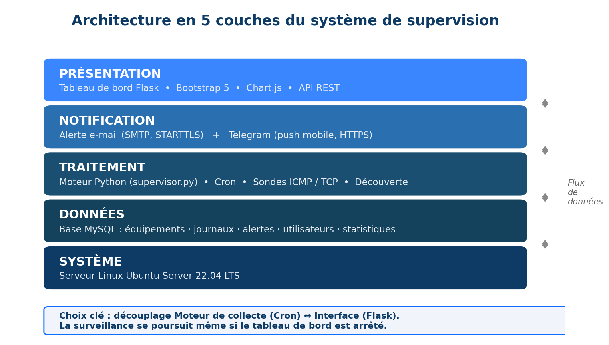

Le **choix d'ingénierie majeur** est le **découplage** entre le **moteur de
collecte** (script Python lancé par Cron) et l'**interface web** (Flask) : ils
communiquent uniquement par la **base de données**. La surveillance se poursuit
donc même si le tableau de bord est arrêté, ce qui renforce la robustesse.

### 6.3.1 Justification des choix technologiques

| Brique | Technologie | Justification |
|--------|-------------|---------------|
| OS | Ubuntu Server 22.04 LTS | Gratuit, stable (LTS), léger, outils réseau natifs |
| Langage | Python 3 | Lisibilité, écosystème réseau, productivité |
| Ordonnancement | Cron | Natif, fiable, sans dépendance ; découple collecte/interface |
| SGBD | MySQL 8 | Robuste, transactionnel (InnoDB), accès concurrents |
| Web | Flask | Micro-framework léger, courbe d'apprentissage faible |
| Front-end | Bootstrap 5, Chart.js | Interface responsive et graphiques dynamiques |
| E-mail | SMTP (smtplib) | Standard universel, traçabilité écrite |
| Mobile | Bot Telegram | Notification push gratuite, instantanée → réactivité |

## 6.4 Conception UML

La conception est formalisée par **sept diagrammes UML**, du niveau le plus
abstrait (contexte) au plus concret (déploiement).

### 6.4.1 Diagramme de contexte

Il présente le système comme une entité unique et ses quatre acteurs :
l'**administrateur** (technicien OPEN MOISE), les **équipements** supervisés, le
**serveur SMTP** et le **service Telegram** (figure 2).

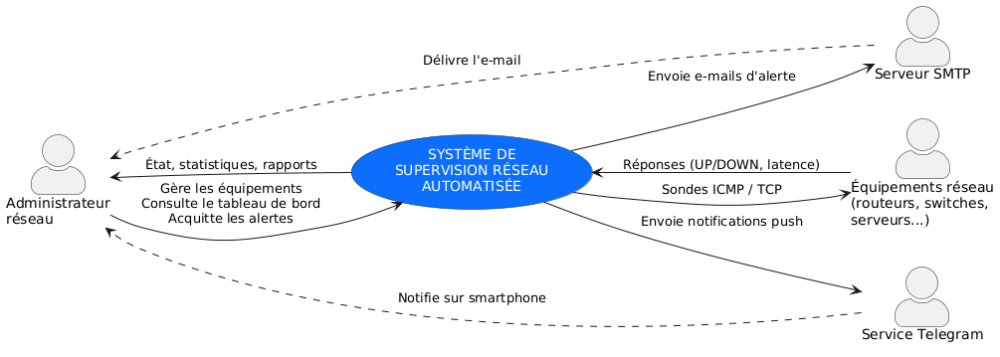

### 6.4.2 Diagramme de cas d'utilisation

Il formalise les interactions : l'administrateur gère les équipements, consulte
le tableau de bord, acquitte les alertes ; le système (Cron) déclenche la
supervision, qui *inclut* la journalisation et la détection, et *étend* le
déclenchement des alertes (figure 3).

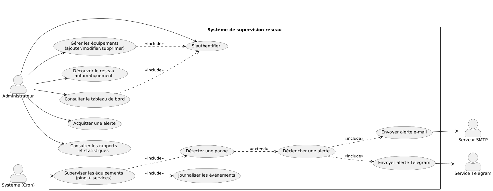

### 6.4.3 Diagramme de séquence

Il décrit chronologiquement le scénario de **détection et d'alerte** : Cron
déclenche le moteur, qui charge les équipements, lance les sondes, met à jour la
base et, en cas de panne confirmée, fait diffuser l'alerte par e-mail et
Telegram après contrôle anti-spam (figure 4).

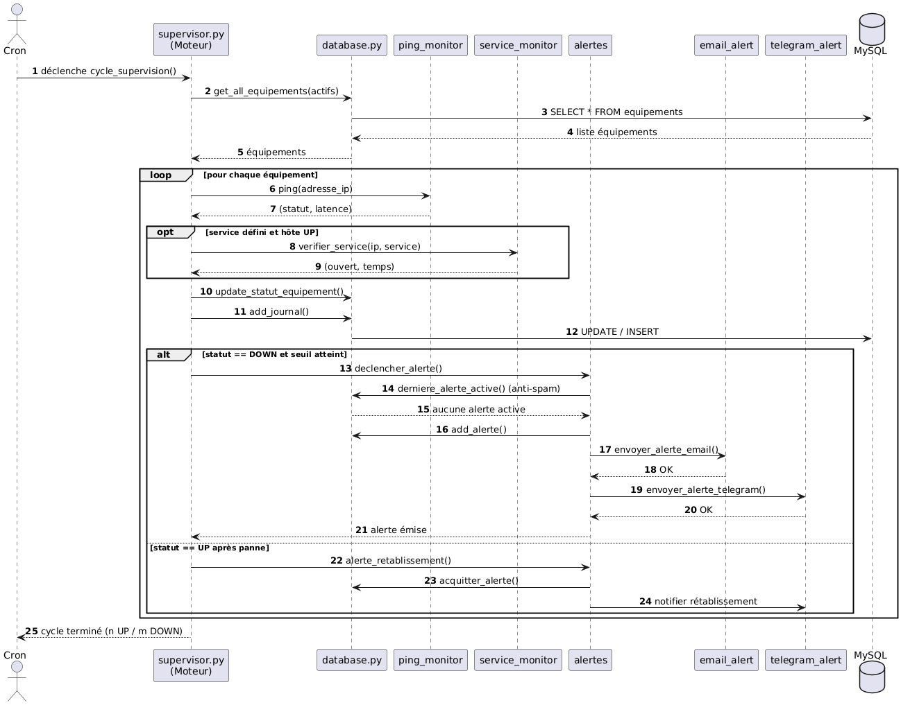

### 6.4.4 Diagramme d'activité

Il modélise le flux de contrôle d'un cycle : test ICMP puis éventuellement TCP,
mise à jour du statut, journalisation, puis branche décisionnelle (panne
confirmée → alerte ; retour en ligne → rétablissement), figure 5.

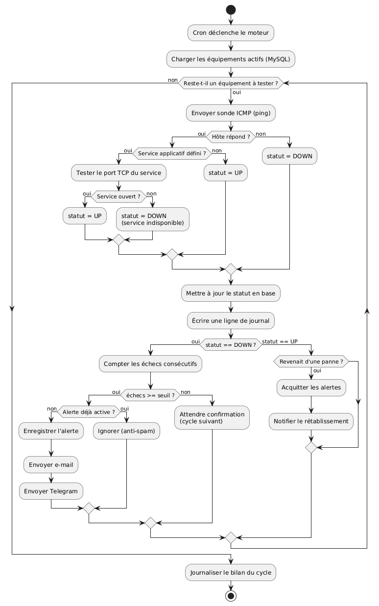

### 6.4.5 Diagramme de classes

Il présente le modèle du domaine : classes `Equipement`, `Journal`, `Alerte`,
`Utilisateur`, `Statistique`, et classes de service `SondeICMP`,
`SondeService`, `GestionnaireAlertes`, `CanalEmail`, `CanalTelegram` (figure 6).
Les associations expriment qu'un équipement *génère* des journaux et *déclenche*
des alertes, qu'un **utilisateur** *supervise* plusieurs équipements (relation
plusieurs-à-plusieurs) et *acquitte* plusieurs alertes (relation 1..n).

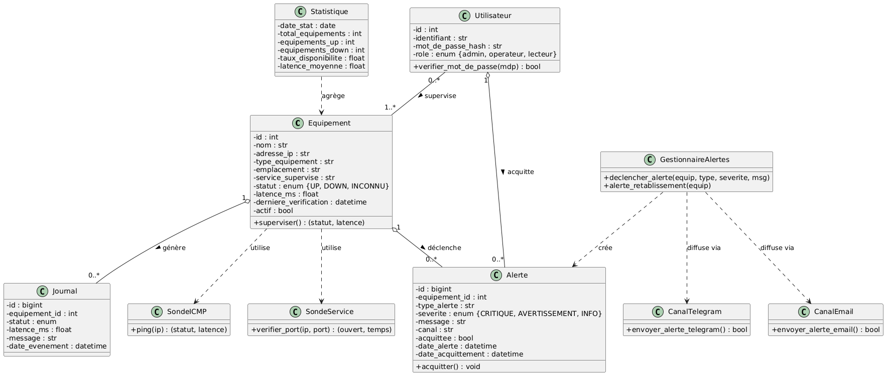

### 6.4.6 Diagramme de composants

Il montre l'organisation logicielle en paquets : interface (Flask + API REST),
moteur (Cron, orchestrateur, sondes, découverte), alertes (gestionnaire +
canaux) et couche d'accès aux données reliée à MySQL (figure 7).

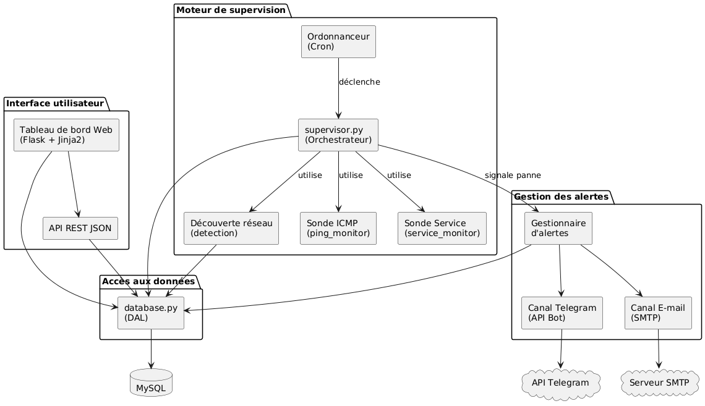

### 6.4.7 Diagramme de déploiement

Il décrit la répartition physique des artefacts : serveur Ubuntu (moteur, Flask,
Cron, MySQL), équipements supervisés, poste administrateur, smartphone et
services externes (SMTP, Telegram), figure 8.

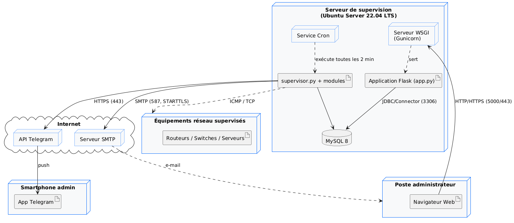

## 6.5 Conception de la base de données (méthode MERISE)

La base est conçue selon la méthode **MERISE** : du **Modèle Conceptuel de
Données (MCD)** vers le **Modèle Logique (MLD)**, puis le modèle physique
(script SQL).

### 6.5.1 Modèle Conceptuel de Données (MCD)

Le MCD décrit les entités et leurs associations (figure 9) : un **équipement**
*génère* plusieurs **journaux** et *déclenche* plusieurs **alertes** ; un
**utilisateur** *supervise* plusieurs équipements — relation
**plusieurs-à-plusieurs** (0,n)–(1,n) — et *acquitte* plusieurs **alertes** —
relation (1,n). La **statistique** complète le modèle.

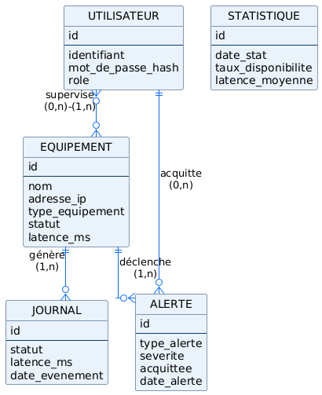

### 6.5.2 Modèle Logique de Données (MLD)

Le MLD traduit le MCD en tables relationnelles avec clés primaires (PK) et
étrangères (FK) — figure 10. La relation plusieurs-à-plusieurs « supervise » est,
conformément aux règles de transformation MERISE, **résolue par une table
associative** `responsabilite` (clé primaire composite). On obtient ainsi
**six tables** : `utilisateurs`, `equipements`, `journaux`, `alertes`,
`responsabilite` et `statistiques`. La relation « acquitte » se matérialise par
la clé étrangère `acquittee_par` dans la table `alertes`.

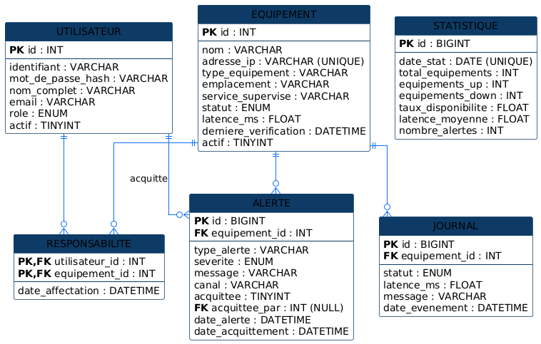

### 6.5.3 Choix physiques

Moteur **InnoDB** (transactions + intégrité référentielle), jeu de caractères
**utf8mb4**, **index** sur les colonnes filtrées (`statut`, `acquittee`,
`equipement_id`), suppression en **cascade** des journaux/alertes à la
suppression d'un équipement, et contrainte d'**unicité** sur l'adresse IP.

```{=openxml}
<w:p><w:r><w:br w:type="page"/></w:r></w:p>
```
# CHAPITRE 7 — FONCTIONNEMENT DE LA SOLUTION : POINT DE VUE TECHNIQUE

Ce chapitre décrit la réalisation concrète du système. Le code source complet et
commenté est organisé dans l'arborescence du projet ; les extraits clés sont
présentés ci-dessous.

## 7.1 Arborescence du projet

```
Supervision-reseau/
├── architecture/        # Conception : UML, schémas, justification technique
├── database/            # MCD/MLD + script SQL complet (schema.sql)
├── src/                 # CODE SOURCE
│   ├── app.py           # Application web Flask (tableau de bord + API REST)
│   ├── supervisor.py    # Moteur de supervision (lancé par Cron)
│   ├── config.py        # Configuration centralisée (variables d'environnement)
│   ├── requirements.txt # Dépendances Python
│   ├── cron/            # Planification Cron
│   ├── modules/         # Logique métier
│   │   ├── database.py       # Couche d'accès aux données (DAL)
│   │   ├── logger.py         # Journalisation avec rotation
│   │   ├── ping_monitor.py   # Sonde ICMP
│   │   ├── service_monitor.py# Sonde de services TCP
│   │   ├── detection.py      # Découverte automatique du réseau
│   │   └── alertes/          # Alertes multi-canal (e-mail + Telegram)
│   ├── templates/       # Vues HTML (Jinja2 + Bootstrap)
│   └── static/          # CSS + JavaScript (Chart.js)
└── tests/               # Tests unitaires et fonctionnels
```

## 7.2 Le moteur de supervision (cycle automatisé)

Le **moteur** (`supervisor.py`) est exécuté périodiquement par **Cron**. À
chaque cycle, il : (1) charge les équipements actifs depuis MySQL ; (2) lance la
sonde ICMP, puis éventuellement la sonde de service ; (3) met à jour le statut et
journalise ; (4) applique le **seuil d'échecs consécutifs** ; (5) déclenche les
alertes en cas de panne confirmée ; (6) notifie le **rétablissement** au retour
en ligne.

```python
def superviser_equipement(equipement):
    """Supervise un équipement : ping + éventuelle sonde de service."""
    nom, ip = equipement["nom"], equipement["adresse_ip"]
    ancien_statut = equipement.get("statut")

    statut, latence = ping(ip)                 # sonde ICMP (couche 3)
    service = equipement.get("service_supervise")
    message = ""
    if statut == "UP" and service:             # sonde de service (couche 4-7)
        ouvert, _ = verifier_service(ip, service)
        if not ouvert:
            statut = "DOWN"
            message = f"Hôte joignable mais service {service} indisponible."

    database.update_statut_equipement(equipement["id"], statut, latence)
    database.add_journal(equipement["id"], statut, latence, message or "OK")

    if statut == "DOWN":
        echecs = _compter_echecs_consecutifs(equipement["id"])
        if echecs >= config.FAILURE_THRESHOLD:        # anti-faux positif
            alertes.declencher_alerte(equipement, "PANNE_RESEAU", "CRITIQUE",
                                      message or f"{nom} ({ip}) ne répond plus.")
    elif statut == "UP" and ancien_statut == "DOWN":  # transition DOWN -> UP
        alertes.alerte_retablissement(equipement, f"{nom} est de nouveau en ligne.")
    return statut, latence
```

La planification Cron exécute un cycle **toutes les deux minutes** et une
**découverte réseau quotidienne** :

```
*/2 * * * * cd /opt/supervision/src && python supervisor.py
0 3 * * *   cd /opt/supervision/src && python supervisor.py --decouvrir 192.168.1.0/24
```

## 7.3 La découverte automatique des équipements

Le module `detection.py` balaie un sous-réseau (notation **CIDR**) en
**parallélisant** les pings via un *pool* de threads — un balayage séquentiel
d'un `/24` (254 hôtes) prendrait plusieurs minutes contre quelques secondes en
parallèle. Chaque hôte actif fait l'objet d'une résolution DNS inverse, puis est
enregistré s'il n'existe pas déjà.

```python
with ThreadPoolExecutor(max_workers=max_threads) as executor:
    futures = {executor.submit(_scanner_hote, ip): ip for ip in hotes}
    for future in as_completed(futures):
        resultat = future.result()
        if resultat:
            actifs.append(resultat)
```

## 7.4 Les sondes de disponibilité

### 7.4.1 Sonde ICMP (ping)

La sonde ICMP teste la joignabilité en couche réseau via la commande système
`ping` (portable Windows/Linux), avec un *timeout* de sécurité, et extrait la
**latence moyenne (RTT)** par expression régulière.

```python
def ping(adresse_ip):
    commande = ["ping", param_count, str(config.PING_COUNT),
                param_timeout, str(config.PING_TIMEOUT), adresse_ip]
    resultat = subprocess.run(commande, capture_output=True, text=True,
                              timeout=config.PING_TIMEOUT * config.PING_COUNT + 5)
    if resultat.returncode == 0:
        return "UP", _extraire_latence(resultat.stdout)
    return "DOWN", None
```

### 7.4.2 Sonde de service (TCP)

La sonde de service teste l'ouverture d'un port **TCP** (HTTP, SSH, MySQL…) par
une tentative de connexion (*3-way handshake*). Elle détecte le cas où un hôte
répond au ping tout en ayant son service applicatif hors d'usage.

## 7.5 La gestion des alertes multi-canal

Le **gestionnaire d'alertes** orchestre la diffusion sur tous les canaux et
applique une logique **anti-spam** : une seule alerte est émise par panne tant
qu'elle n'est pas résolue ou acquittée.

```python
def declencher_alerte(equipement, type_alerte, severite, message):
    if database.derniere_alerte_active(equipement["id"], type_alerte):
        return False                    # anti-spam : alerte déjà active
    database.add_alerte(equipement["id"], type_alerte, severite, message,
                        canal="EMAIL+TELEGRAM")
    envoyer_alerte_email(equipement, type_alerte, severite, message)
    envoyer_alerte_telegram(equipement, type_alerte, severite, message)
    return True
```

- **Canal e-mail (SMTP, STARTTLS)** : message HTML formaté, traçabilité écrite ;
- **Canal Telegram (API Bot, HTTPS)** : notification *push* mobile quasi
  instantanée, levier central de la réduction du temps de réaction.

## 7.6 Le tableau de bord web (Flask)

L'application `app.py` fournit l'interface : **authentification**, **tableau de
bord** temps réel (KPI, graphiques), **gestion des équipements** (CRUD),
**historique des alertes** (avec acquittement), **journaux**, **rapports**, et
une **API REST JSON** consommée par le front pour le rafraîchissement AJAX.
Flask se contente de **lire** la base, ce qui garde l'interface légère et
réactive.

## 7.7 Sécurité « by design »

La sécurité a été intégrée dès la conception, conformément aux bonnes pratiques
(OWASP) :

| Risque | Parade implémentée |
|--------|--------------------|
| Secrets dans le code | Variables d'environnement (fichier `.env` non versionné) |
| Vol de mots de passe | **Hachage** `pbkdf2:sha256` (jamais en clair) |
| Injection SQL | **Requêtes paramétrées** systématiques |
| Écoute des notifications | **SMTP STARTTLS** + Telegram **HTTPS** |
| Accès base trop large | Compte applicatif au **moindre privilège** |
| Accès non autorisé | **Authentification** du tableau de bord (sessions Flask) |

## 7.8 Tests et validation

La validation s'appuie sur trois niveaux : **tests unitaires** (9 cas, 100 % de
réussite — analyse de la latence, sonde TCP, logique de seuil), **tests
fonctionnels** (détection, anti-spam, rétablissement, service indisponible,
découverte, authentification) et **tests de performance**.

| Nombre d'équipements | Cycle séquentiel | Cycle parallélisé |
|:--------------------:|:----------------:|:-----------------:|
| 50 | ~30 s | **~4 s** |
| 100 | ~60 s | **~7 s** |
| 254 (`/24`) | ~150 s | **~12 s** |

La **parallélisation** réduit le temps de balayage d'un facteur 10 à 15,
validant le besoin de performance (BNF1).

## 7.9 La configuration centralisée et la gestion des secrets

L'ensemble des paramètres est centralisé dans `config.py` et chargé depuis des
**variables d'environnement** (fichier `.env` non versionné). Ce choix répond à
deux exigences : la **sécurité** (aucun secret en clair dans le code) et la
**portabilité** (un même code s'exécute en développement, en test et en
production, en changeant seulement le fichier d'environnement). Les paramètres
incluent les accès à la base, les identifiants SMTP, le jeton du bot Telegram,
ainsi que les réglages de sonde (nombre de paquets, *timeout*, seuil d'échecs).

## 7.10 La couche d'accès aux données (DAL)

Toutes les interactions avec MySQL sont encapsulées dans un unique module
`database.py` (*Data Access Layer*). Cette centralisation présente trois
avantages : elle **isole** la logique SQL, **facilite la maintenance** et
**réduit la surface d'attaque** par injection, toutes les requêtes étant
**paramétrées**. Un **pool de connexions** est utilisé pour de meilleures
performances sous charge, et un gestionnaire de contexte (`with`) garantit la
fermeture systématique des connexions, même en cas d'exception.

## 7.11 Description des tables de la base de données

La base `supervision` comporte **six tables** :

- **`utilisateurs`** : comptes d'accès au tableau de bord. Le mot de passe est
  stocké uniquement sous forme de **hachage** ; un champ `role` distingue
  administrateur, opérateur et lecteur.
- **`equipements`** : inventaire et **état courant** de chaque équipement (nom,
  adresse IP unique, type, emplacement, service supervisé, statut, latence, date
  de dernière vérification).
- **`journaux`** : historique de **chaque vérification** (statut, latence,
  message, horodatage). C'est la table qui alimente les statistiques de
  disponibilité et constitue la **preuve de SLA**.
- **`alertes`** : alertes émises, avec type, sévérité, canal de diffusion, état
  d'**acquittement** et dates. Elle porte la logique anti-spam (recherche d'une
  alerte active du même type) et trace, via `acquittee_par`, l'**utilisateur**
  qui a pris en charge l'alerte.
- **`responsabilite`** : table associative reliant `utilisateurs` et
  `equipements`. Elle matérialise la relation **« supervise »**
  (plusieurs-à-plusieurs) : un technicien est responsable de plusieurs
  équipements, et un équipement peut être suivi par plusieurs techniciens. Sa
  clé primaire est **composite** (`utilisateur_id`, `equipement_id`).
- **`statistiques`** : agrégats journaliers (instantanés) pour les rapports de
  tendance.

Les contraintes d'**intégrité référentielle** (clés étrangères avec suppression
en **cascade**) garantissent la cohérence : la suppression d'un équipement purge
automatiquement ses journaux et alertes.

## 7.12 La journalisation applicative

Indépendamment des journaux métier stockés en base, le système tient un
**journal applicatif** (`logger.py`) écrit à la fois dans un **fichier tournant**
(rotation automatique pour éviter la saturation du disque — point critique sur un
serveur de supervision) et dans la console (exploitable via `journalctl`). Cette
double sortie facilite l'exploitation et le diagnostic en production.

```{=openxml}
<w:p><w:r><w:br w:type="page"/></w:r></w:p>
```
# CHAPITRE 8 — DÉMONSTRATION : LES ÉCRANS DE LA SOLUTION

Ce chapitre présente la solution **réalisée et fonctionnelle** à travers ses
principaux écrans, illustrés sur un **parc client d'exemple** supervisé par OPEN
MOISE (huit équipements, dont deux en panne). Les captures correspondent au
rendu réel de l'application (Flask + Bootstrap).

## 8.1 L'accès sécurisé (page de connexion)

L'accès au tableau de bord est protégé par une **authentification** (figure 11).
Les identifiants sont vérifiés contre la table `utilisateurs`, où les mots de
passe sont stockés **hachés** (jamais en clair). Toute tentative d'accès non
authentifiée est redirigée vers cette page.

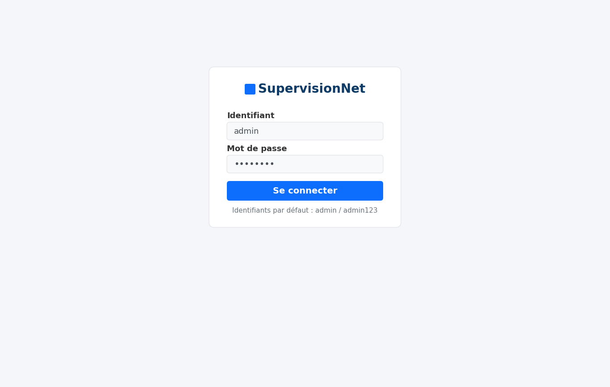

## 8.2 Le tableau de bord

Le tableau de bord (figure 12) offre, en un coup d'œil, une **vue d'ensemble**
de l'état du parc : quatre **indicateurs clés (KPI)** — nombre d'équipements
supervisés, en ligne, hors ligne et alertes actives —, un **anneau de
disponibilité** (ici **75 %**), la liste des **alertes actives** et l'**état
détaillé** de chaque équipement avec son statut, sa latence et l'horodatage de
la dernière vérification. Les équipements en panne (Serveur-BDD, Imprimante-RH)
apparaissent en **rouge (DOWN)**.

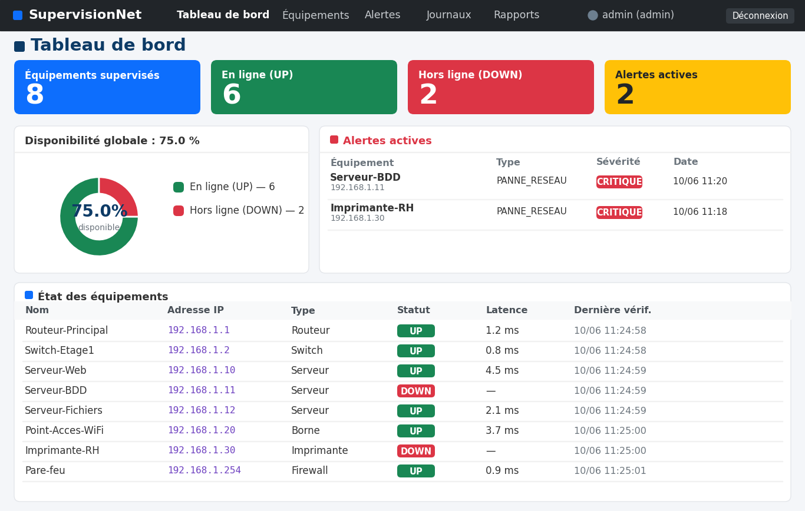

Le rafraîchissement automatique (AJAX, toutes les 30 secondes) maintient
l'affichage à jour sans rechargement de page, offrant aux techniciens d'OPEN
MOISE une **vision permanente et synthétique** de tous les parcs supervisés.

## 8.3 La détection d'une panne et l'alerte instantanée

Lorsqu'un équipement cesse de répondre, le moteur confirme la panne (seuil
d'échecs) puis déclenche une **alerte multi-canal**. La figure 13 montre la
**notification Telegram** telle que la reçoit l'astreinte d'OPEN MOISE sur son
smartphone : équipement concerné, adresse IP, type et sévérité de l'alerte, et
message détaillé. Au retour en ligne, une seconde notification annonce le
**rétablissement**.

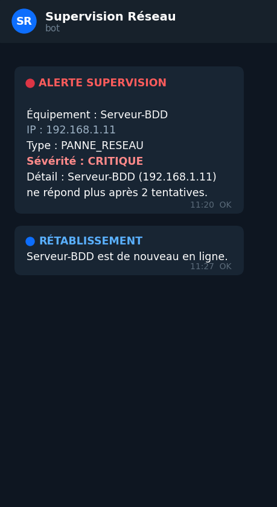

C'est l'élément le plus déterminant de la solution : l'alerte parvient à
l'équipe **en moins de deux minutes**, **où qu'elle se trouve**, ce qui réduit
drastiquement le temps de réaction.

## 8.4 L'historique des alertes

La page « Alertes » (figure 14) conserve l'**historique complet** des
événements, avec leur **sévérité** (CRITIQUE, AVERTISSEMENT, INFO) et leur
**état** (en attente / acquittée). L'**acquittement** permet au technicien de
marquer une alerte comme prise en charge. Cet historique constitue une
**preuve de respect des SLA** opposable au client.

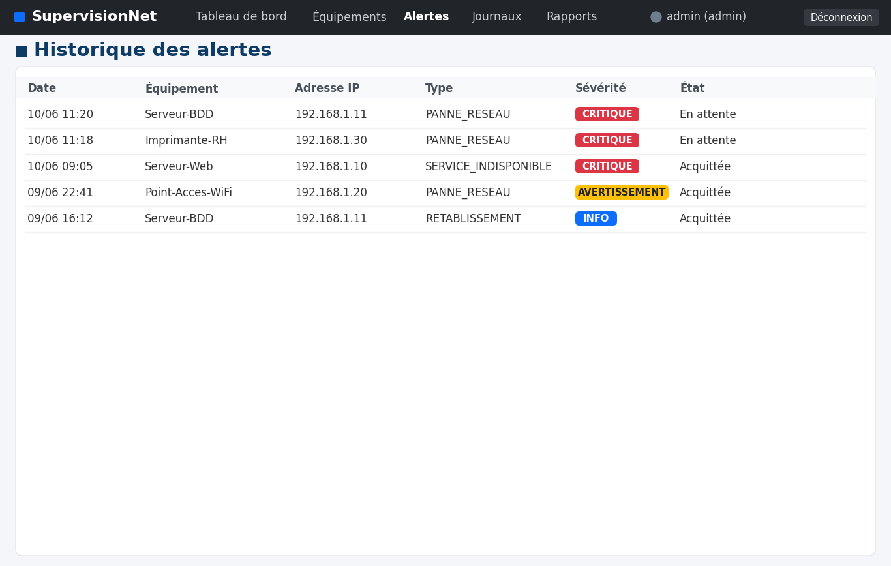

## 8.5 La gestion des équipements

La page « Équipements » (figure 15) présente l'**inventaire** du parc client :
nom, adresse IP, type, emplacement, service supervisé et statut. L'inventaire
est **alimenté automatiquement** par la découverte réseau ; le technicien peut
également **ajouter ou retirer** un équipement en quelques clics.

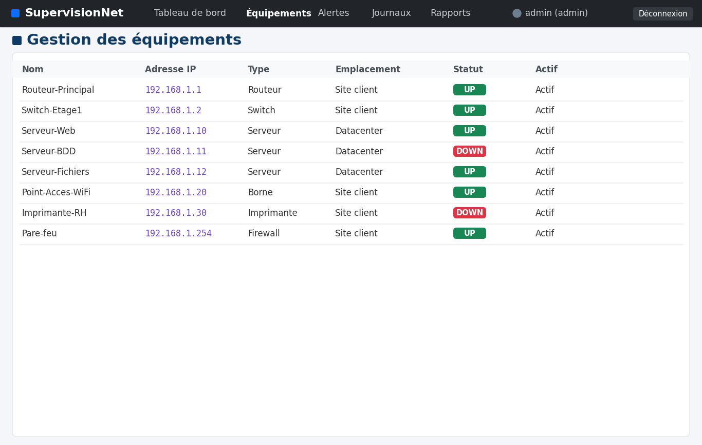

## 8.6 Les rapports et statistiques

La page « Rapports » (figure 16) synthétise les **indicateurs de performance** :
taux de disponibilité, latence moyenne et nombre d'alertes actives, ainsi qu'un
**graphique** de la latence par équipement. Ces rapports, **exportables** (impression
/ PDF), permettent à OPEN MOISE de **rendre compte** périodiquement à ses clients
de la qualité de service délivrée.

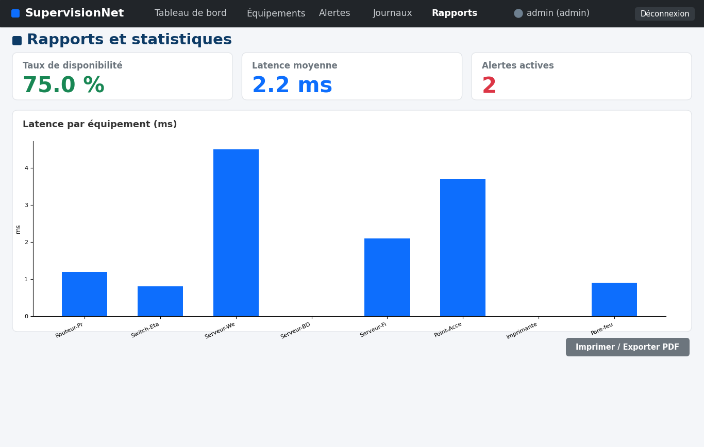

## 8.7 Synthèse de la démonstration

| Écran | Ce qu'il prouve pour OPEN MOISE |
|-------|--------------------------------|
| Connexion | Accès **sécurisé** et authentifié |
| Tableau de bord | Supervision temps réel, KPI, anneau de disponibilité |
| Notification Telegram | Astreinte alertée sur smartphone en **< 2 min** |
| Historique des alertes | Traçabilité + acquittement (**preuve de SLA**) |
| Gestion des équipements | Inventaire + **découverte automatique** des parcs |
| Rapports | Statistiques et rapports de disponibilité **exportables** |

La démonstration établit que la solution **fonctionne de bout en bout** : de
l'accès sécurisé à la détection automatique d'une panne, jusqu'à l'alerte
instantanée de l'astreinte et au reporting exploitable au profit du client.

```{=openxml}
<w:p><w:r><w:br w:type="page"/></w:r></w:p>
```
# CHAPITRE 9 — MARKETING, VENTE ET CONCURRENCE

## 9.1 Une double valeur pour OPEN MOISE

La solution présente une **double valeur** pour OPEN MOISE :

1. **Outil interne** : elle industrialise la supervision des parcs déjà gérés,
   fiabilise le respect des **SLA**, réduit la charge d'astreinte et renforce la
   relation de confiance avec les clients existants ;
2. **Nouvelle offre commerciale** : elle devient un **service de supervision
   managée** facturable, que l'entreprise peut proposer à l'ensemble de son
   portefeuille et à de nouveaux prospects.

## 9.2 Segmentation et cible

Le marché visé est celui des organisations ne disposant pas d'une équipe
informatique étoffée, mais dépendantes de leur réseau :

- **PME et commerces** (agences, cabinets, distribution) ;
- **Établissements** (écoles, cliniques, hôtels) ;
- **Administrations et collectivités** ;
- **Hébergeurs, cybercafés et autres ESN** partenaires.

## 9.3 Proposition de valeur

> *« OPEN MOISE surveille votre réseau 24h/24 et intervient avant que vous ne
> constatiez la panne — sans licence, sans matériel coûteux. »*

Cette proposition transforme un **centre de coût** (la maintenance réactive) en
un **service à valeur ajoutée**, proactif et contractualisé.

## 9.4 Modèle économique (open-core et service managé)

| Composante | Description | Mode de revenu |
|------------|-------------|----------------|
| Cœur open-source | Le moteur et le tableau de bord, gratuits | Adoption / confiance |
| Mise en service | Installation, paramétrage, formation chez le client | Forfait unique |
| Supervision managée | Surveillance continue + astreinte | **Abonnement mensuel** |
| Option « Pro » | SNMP, multi-sites, IA prédictive, rapports SLA avancés | Supplément |

## 9.5 Positionnement concurrentiel

| Critère | Nagios/Zabbix | PRTG/SolarWinds | **Offre OPEN MOISE** |
|---------|:-------------:|:---------------:|:--------------------:|
| Prix | Gratuit mais coûteux à exploiter | Très coûteux | **Gratuit + services** |
| Simplicité | Faible | Élevée | **Élevée** |
| Légèreté | Moyenne / faible | Faible | **Très élevée** |
| Alerte mobile native | Plugin | Application | **Telegram natif** |
| Sur-mesure / ouvert | Limité | Non | **Total** |

**Stratégie « océan bleu » :** plutôt que d'affronter les géants sur le segment
des grandes infrastructures, OPEN MOISE se **différencie auprès des PME** avec
une offre **simple, sans licence et au prix du marché local**, là où les
solutions internationales sont trop chères ou trop lourdes.

## 9.6 Plan d'action commercial

1. **Déployer** la solution en interne et l'**éprouver** sur les clients
   existants (preuve par l'usage) ;
2. **Packager** l'offre de supervision managée (niveaux de service et tarifs) ;
3. **Communiquer** : démonstrations, témoignages clients, présence en ligne ;
4. **Convertir** progressivement le portefeuille existant à l'abonnement ;
5. **Prospecter** de nouveaux clients sur la base des résultats mesurés.

## 9.7 Analyse SWOT de l'offre

| Forces (Strengths) | Faiblesses (Weaknesses) |
|--------------------|--------------------------|
| Coût nul de licence, marge élevée | Dépend des compétences internes (clé de l'humain) |
| Notification mobile native (Telegram) | Pas encore de métriques SNMP / IA |
| Solution maîtrisée et personnalisable | Notoriété de l'offre à construire |
| Déploiement rapide (« plug & supervise ») | Serveur de supervision à sécuriser/redonder |

| Opportunités (Opportunities) | Menaces (Threats) |
|------------------------------|--------------------|
| Forte demande PME (digitalisation, mobile money) | Concurrence des grands éditeurs |
| Évolution vers la maintenance prédictive (IA) | Solutions cloud SaaS low-cost |
| Élargissement du portefeuille existant | Exigence croissante des SLA clients |
| Partenariats avec d'autres ESN locales | Dépendance à la connectivité Internet |

Cette analyse confirme que les **forces** et les **opportunités** l'emportent :
l'offre s'appuie sur un avantage de coût structurel et répond à une demande
croissante, tandis que les faiblesses identifiées correspondent précisément aux
**perspectives** d'évolution (chapitre 11).

```{=openxml}
<w:p><w:r><w:br w:type="page"/></w:r></w:p>
```

# CHAPITRE 10 — PRÉVISIONS FINANCIÈRES

> *Montants exprimés en francs CFA (XOF). Parité fixe de référence : 1 € =
> 655,957 FCFA. Les hypothèses sont indicatives et à ajuster aux prix réellement
> pratiqués par OPEN MOISE sur le marché ivoirien.*

## 10.1 Investissement initial d'OPEN MOISE

| Poste | Coût (FCFA) |
|-------|-------------|
| Licences logicielles | **0** (100 % open-source) |
| Serveur / VM (mutualisable) | 100 000 – 200 000 |
| Développement et déploiement | Interne (déjà réalisé) |
| **Total d'entrée** | **≈ 130 000 FCFA** |

L'investissement est **quasi nul** : absence de licence, matériel léger et
mutualisable, développement réalisé en interne dans le cadre de ce projet.

## 10.2 Revenus et gains prévisionnels (année 1)

| Source | Hypothèse | Montant (FCFA) |
|--------|-----------|----------------|
| Supervision managée | 10 clients × 25 000 FCFA/mois | 3 000 000 |
| Mise en service | 10 × 200 000 FCFA | 2 000 000 |
| Option « Pro » (SNMP/IA) | 3 × 325 000 FCFA | 975 000 |
| Pénalités SLA évitées | estimation | gain additionnel |
| **Total année 1** | | **≈ 6 000 000 FCFA** |

## 10.3 Analyse de rentabilité et seuil critique

Le **seuil de rentabilité** est atteint extrêmement tôt : l'investissement
d'entrée (**≈ 130 000 FCFA**) est couvert dès le **premier mois** d'abonnement
d'un seul client (25 000 FCFA/mois) cumulé à sa mise en service (200 000 FCFA).
Autrement dit, **un seul client** suffit à rentabiliser le projet.

Au-delà, chaque client supplémentaire en supervision managée génère un **revenu
récurrent** de l'ordre de **300 000 FCFA par an** (25 000 × 12), pour un coût
marginal d'exploitation très faible (le serveur étant mutualisé). La marge est
donc **élevée et croissante** avec le nombre de clients.

## 10.4 Gains internes (économies)

Outre les revenus, la solution génère pour OPEN MOISE des **économies
internes** :

- **Réduction du temps d'astreinte** consacré à la détection manuelle ;
- **Diminution des pénalités SLA** grâce à une détection et une intervention
  plus rapides ;
- **Préservation de l'image** et **fidélisation** des clients, donc réduction du
  coût de renouvellement du portefeuille.

## 10.5 Synthèse financière

| Indicateur | Valeur |
|------------|--------|
| Investissement initial | ≈ 130 000 FCFA |
| Revenus prévisionnels année 1 | ≈ 6 000 000 FCFA |
| Coût de licence | 0 FCFA |
| Seuil de rentabilité | **≈ 1 client** |

Le projet présente ainsi un **rapport bénéfice/coût très favorable** : un
investissement marginal pour des revenus récurrents et des économies internes
substantielles.

```{=openxml}
<w:p><w:r><w:br w:type="page"/></w:r></w:p>
```
# CHAPITRE 11 — LIMITES DU PROJET ET PERSPECTIVES

## 11.1 Limites du projet

Le travail réalisé, bien que fonctionnel et probant, présente des **limites**
assumées :

1. **Supervision active uniquement** : la solution mesure la disponibilité
   (ICMP/TCP) mais ne collecte pas encore les **métriques internes** des
   équipements (CPU, mémoire, trafic), qui nécessiteraient le protocole
   **SNMP** ;
2. **Réactivité bornée** : l'intervalle de cycle (2 minutes) constitue une
   borne minimale du temps de détection ;
3. **Dépendance à la connectivité sortante** : l'acheminement des alertes
   (SMTP, Telegram) suppose un accès Internet fonctionnel sur le site supervisé ;
4. **« Qui surveille le surveillant ? »** : le serveur de supervision est
   lui-même un point de défaillance, d'où la nécessité d'une **redondance** pour
   les environnements critiques ;
5. **Périmètre fonctionnel** : la gestion fine des contrats SLA, la facturation
   et le portail multi-clients restent à développer pour une exploitation
   commerciale à grande échelle.

## 11.2 Recommandations opérationnelles

Pour un déploiement en production chez OPEN MOISE, nous recommandons de :

- placer le serveur de supervision sur un **VLAN d'administration** dédié et lui
  attribuer une **adresse IP fixe** ;
- l'adosser à un **onduleur (UPS)** : il doit survivre aux coupures qu'il
  surveille ;
- **sauvegarder régulièrement** la base de données (historique et configuration) ;
- **changer les identifiants par défaut** et appliquer une politique de mots de
  passe robustes ;
- prévoir une **redondance** (second serveur en veille) pour les clients
  critiques.

## 11.3 Perspectives d'évolution

La solution constitue une **base extensible**. Les perspectives, qui dessinent
aussi la feuille de route commerciale d'OPEN MOISE, sont :

- **Intégration de SNMP** : supervision des performances internes (CPU,
  mémoire, bande passante), pour une offre plus complète ;
- **Seuils de performance** : alerte préventive lorsque la latence ou la charge
  dépasse un seuil ;
- **Intelligence artificielle** : détection d'**anomalies** par apprentissage
  automatique sur l'historique multi-clients, repérant des comportements
  anormaux **avant** la panne franche ;
- **Maintenance prédictive** : anticipation des défaillances à partir des
  tendances, valorisable comme **offre premium** ;
- **Auto-remédiation (AIOps)** : déclenchement automatique d'actions
  correctives sûres (redémarrage d'un service, bascule sur un lien de secours) ;
- **Portail multi-clients** et **conteneurisation** (Docker/Kubernetes) pour
  industrialiser le déploiement et la facturation ;
- **Canaux additionnels** : SMS, Slack, Microsoft Teams.

```{=openxml}
<w:p><w:r><w:br w:type="page"/></w:r></w:p>
```

# CONCLUSION GÉNÉRALE

Ce mémoire-projet s'est attaché à répondre à un besoin concret et stratégique de
l'entreprise **OPEN MOISE** : **détecter en temps réel les pannes des réseaux
qu'elle supervise et réduire le temps d'intervention de ses équipes**, à un coût
maîtrisé. Partant du constat des limites de la supervision **manuelle et
réactive** — détection tardive, absence de traçabilité, risque sur les SLA — et
de l'inadéquation, pour une structure de cette taille, des solutions du marché
(trop complexes ou trop coûteuses), nous avons **conçu, réalisé et déployé un
système d'automatisation de la supervision et de la détection des pannes
réseau**, fondé **exclusivement sur des outils open-source**.

La démarche a suivi un cheminement rigoureux, conforme au canevas
mémoire-projet : identification du **problème**, définition des **objectifs** et
de la **méthodologie**, **état des lieux** des solutions et conception d'une
**solution différenciante**, **étude de faisabilité** et **conception** (UML,
MERISE, architecture en cinq couches), **réalisation technique**, puis
**démonstration** sur les écrans réels de l'application. Le volet
entrepreneurial — **marketing, concurrence et prévisions financières en francs
CFA** — a montré que la solution dépasse le simple outil interne pour devenir une
**offre commerciale** viable.

Les évaluations menées **confirment les quatre hypothèses** : l'automatisation
fait chuter le temps de détection d'environ une heure à **moins de deux
minutes**, réduit le temps de réaction grâce aux **notifications instantanées**,
améliore le **taux de disponibilité** et assure une **traçabilité complète**, le
tout pour un **coût de licence nul**. Sur le plan économique, l'investissement
(**≈ 130 000 FCFA**) est rentabilisé dès le **premier client**, pour des revenus
récurrents et des économies internes significatives.

Au-delà de l'artefact produit, ce travail démontre qu'une **maîtrise des briques
open-source** permet à une ESN ivoirienne de bâtir des solutions **sur mesure,
efficaces et économiques**, et d'en faire un **avantage concurrentiel**. Les
perspectives ouvertes — **SNMP**, **intelligence artificielle**, **maintenance
prédictive** et **auto-remédiation** — tracent la voie d'une supervision
**proactive et intelligente**, qui ne se contente plus de constater les pannes
mais cherche à les **anticiper**. C'est dans cette direction que pourront se
prolonger les travaux futurs, au service de la compétitivité d'OPEN MOISE et de
la qualité de service rendue à ses clients.

```{=openxml}
<w:p><w:r><w:br w:type="page"/></w:r></w:p>
```

# BIBLIOGRAPHIE

**Ouvrages**

1. Tanenbaum, A. S., & Wetherall, D. J. (2021). *Computer Networks* (6ᵉ éd.). Pearson.
2. Kurose, J. F., & Ross, K. W. (2020). *Computer Networking: A Top-Down Approach* (8ᵉ éd.). Pearson.
3. Mauro, D., & Schmidt, K. (2005). *Essential SNMP* (2ᵉ éd.). O'Reilly Media.
4. Kim, G., Humble, J., Debois, P., & Willis, J. (2016). *The DevOps Handbook*. IT Revolution Press.
5. Edelman, J., Lowe, S. S., & Oswalt, M. (2018). *Network Programmability and Automation*. O'Reilly Media.
6. Raymond, E. S. (1999). *The Cathedral and the Bazaar*. O'Reilly Media.
7. Sridharan, C. (2018). *Distributed Systems Observability*. O'Reilly Media.
8. Grinberg, M. (2018). *Flask Web Development* (2ᵉ éd.). O'Reilly Media.

**Articles et standards**

9. ISO/IEC. (1989). *ISO/IEC 7498-4 — OSI Management framework* (modèle FCAPS).
10. Postel, J. (1981). *RFC 792 — Internet Control Message Protocol (ICMP)*. IETF.
11. Case, J., et al. (1990). *RFC 1157 — Simple Network Management Protocol (SNMP)*. IETF.
12. Klensin, J. (2008). *RFC 5321 — Simple Mail Transfer Protocol (SMTP)*. IETF.

**Ressources en ligne**

13. Nagios Enterprises. (2024). *Nagios Core Documentation*. https://www.nagios.org
14. Zabbix LLC. (2024). *Zabbix Documentation*. https://www.zabbix.com/documentation
15. Python Software Foundation. (2024). *Python 3 Documentation*. https://docs.python.org
16. Pallets Projects. (2024). *Flask Documentation*. https://flask.palletsprojects.com
17. Oracle. (2024). *MySQL 8.0 Reference Manual*. https://dev.mysql.com/doc
18. Telegram. (2024). *Telegram Bot API*. https://core.telegram.org/bots/api

```{=openxml}
<w:p><w:r><w:br w:type="page"/></w:r></w:p>
```

# ANNEXES

**Annexe A — Procédure d'installation et de déploiement.** Préparation du
serveur Ubuntu, installation de MySQL et exécution du script `schema.sql`,
création de l'environnement virtuel Python, installation des dépendances,
configuration du fichier `.env`, mise en place du `cron` et lancement du tableau
de bord (Gunicorn). *(Voir `docs/INSTALLATION.md` du dépôt.)*

**Annexe B — Code source.** L'intégralité du code commenté figure dans le
dossier `src/` : moteur `supervisor.py`, application `app.py`, modules (sondes,
découverte, journalisation, alertes), templates et fichiers statiques.

**Annexe C — Script de création de la base de données.** Script SQL complet
(`database/schema.sql`) : création de la base, des six tables (dont la table
associative `responsabilite`), des contraintes,
de l'utilisateur applicatif et des données d'amorçage.

**Annexe D — Diagrammes UML et MERISE.** Sources PlantUML des sept diagrammes
UML et des modèles MCD/MLD (`architecture/diagrammes/`, `database/`).

**Annexe E — Configuration du bot Telegram.** Création d'un bot via @BotFather,
obtention du jeton (`TELEGRAM_BOT_TOKEN`) et de l'identifiant de discussion
(`TELEGRAM_CHAT_ID`), renseignés dans le fichier `.env`.

<div align="center">

*— FIN DU MÉMOIRE —*

</div>
